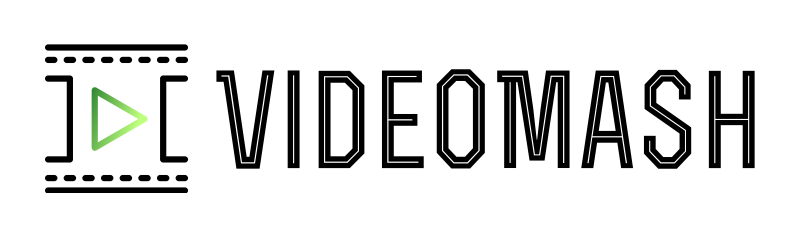
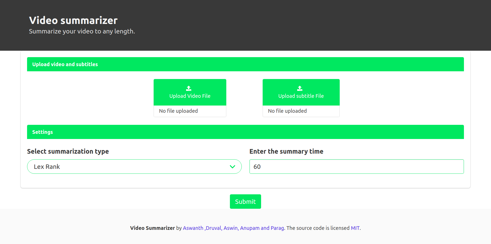
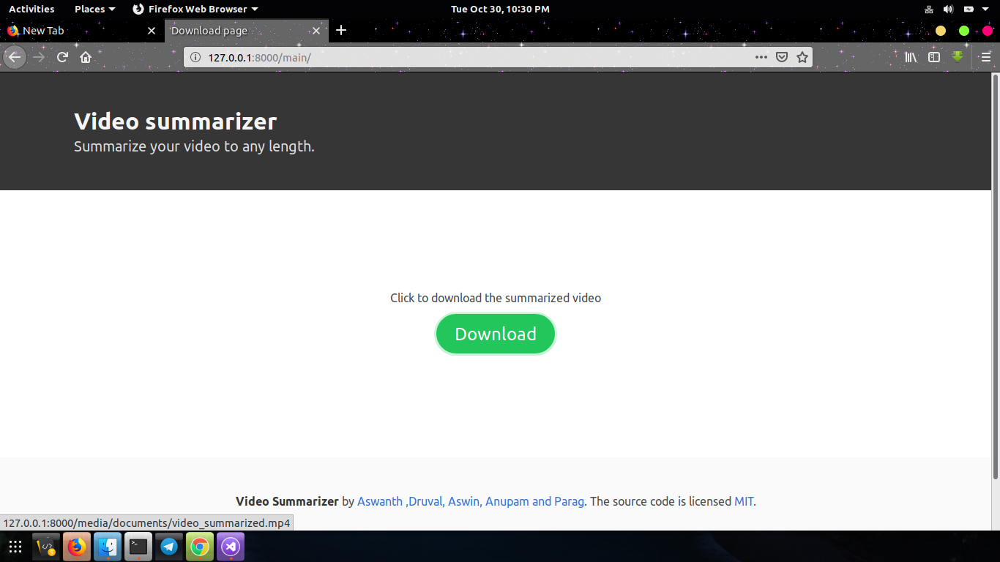
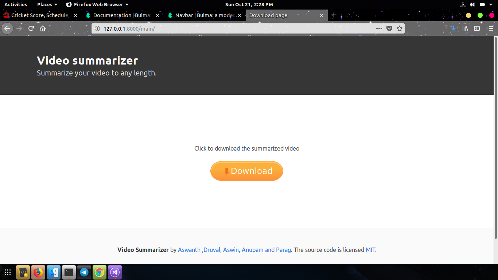

<br>

# What it does?

VideoMash is a video summarizer where in you can upload any video from local system or can provide the YouTube URL for your video to summarize it into any duration which you provide as input. Summarization is done using NLP algorithms which is used to analyze the subtitles of the video to extract the important parts. 

Read medium article : [Video summarizer made easy](https://medium.com/@aswanthkanil/video-summarizer-made-easy-using-nlp-af0afdea49b5)

# Features
- Summarize using upload option
- Summarize using YouTube URL
- Can summarize video to any duration 
- Does speech recognition to Generate videos wit
- Has 5 NLP algorithms for summarization.
- Can combine any 5 NLP algorithms for summarization.
- Easy to use

# How to fire it up? 

- Gotta imstall the requirements first

``` pip install -r requirements.txt```

- Now run the server

```python manage.py runserver```

- The web app is up and running on [localhost:8000](https://localhost:8000/)

# How to use 
- Upload a video file
- Upload the corresponding subtitle file if you have any( Preferred to have)
- Or input the video youtube-link
- Click on download button to download the summarized video

# Screenshots







# Demo 

Watch the Demo video click the image below.

### [Demo](https://youtu.be/o1EVxMbbJa0)

# Contributions
If you find any issues do raise it and your contributions will be accepted if it makes the web app perform better. 

# Warning
 When you push any changes to the repo, ***dont forget to delete all the files in the directory /media/documents/*** where all the uploaded videos and subititle are stored.

